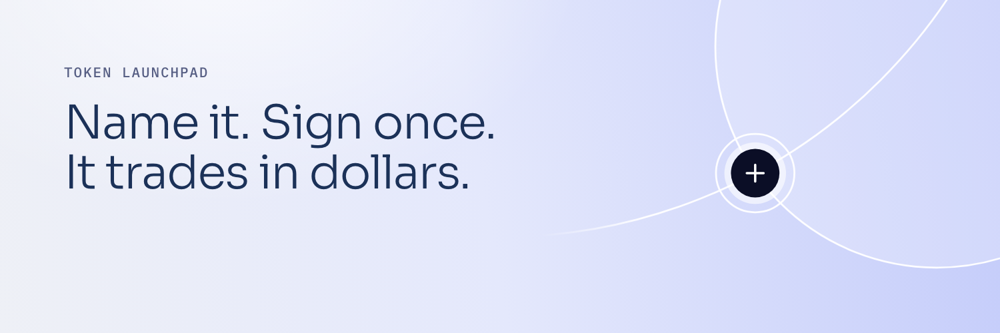
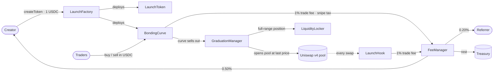

<picture>
  <source media="(prefers-color-scheme: dark)" srcset="assets/banner-dark.png">
  
</picture>

<h1>
  
  mercuri launch · contracts
</h1>

[](https://explorer.arc.io/address/0x8f5DfA0c48E14cCD03AE01795B8a95759BA859EB)
[](deployments/5042.json)
[](#build-and-verify)
[](foundry.toml)
[](src/LaunchHook.sol)
[](LICENSE)

The Solidity source of **[launch.mercuri.finance](https://launch.mercuri.finance)**, a token launchpad on Arc, exactly
as deployed to mainnet on 21 September 2026. Contracts, the vendored dependencies they were compiled against, the
deployment records and the contract review reports. The backend and the web app are separate and not published.

A launch is one transaction. The token trades on a bonding curve in USDC, so every price, fee and market cap is a
dollar figure from the first block. The buy that sells the curve out opens a Uniswap v4 pool at the curve's last
price in the same transaction, and the pool position goes to a locker contract with no withdraw function.

**Contents** · [Deployment](#deployment) · [How it works](#how-it-works) · [Contracts](#contracts) ·
[Parameters](#parameters) · [Events](#events) · [Build and verify](#build-and-verify) · [Security](#security) ·
[License](#license)

## Deployment

Arc mainnet, chain 5042, version 1.0.0, block 22,060,881.

| Contract | Address | Mutability |
| --- | --- | --- |
| LaunchFactory | [`0x8f5DfA0c48E14cCD03AE01795B8a95759BA859EB`](https://explorer.arc.io/address/0x8f5DfA0c48E14cCD03AE01795B8a95759BA859EB) | proxy · implementation [`0xecE7…9711`](https://explorer.arc.io/address/0xecE7FD8F52F8114032AB08f72628B4B4CF489711) |
| FeeManager | [`0x31D1bfe59B783f4c077F853f962D1355AfB52580`](https://explorer.arc.io/address/0x31D1bfe59B783f4c077F853f962D1355AfB52580) | proxy · implementation [`0xD2d7…7A52`](https://explorer.arc.io/address/0xD2d7865b351C1902F5ECFA6187B6B60542027A52) |
| GraduationManager | [`0x5E82a03a30a1627Cb0Fa860dBe708e262e5124e4`](https://explorer.arc.io/address/0x5E82a03a30a1627Cb0Fa860dBe708e262e5124e4) | proxy · implementation [`0x033a…3A44`](https://explorer.arc.io/address/0x033aDa8dA6db7b141382DA9Ab0784659deCE3A44) |
| LaunchHook | [`0xe6D50A6e12f3883605A4456dCDEe50EE05fAE0Cc`](https://explorer.arc.io/address/0xe6D50A6e12f3883605A4456dCDEe50EE05fAE0Cc) | immutable |
| LiquidityLocker | [`0x278e5162074BC4fc98e91E90857FDbc374d1f391`](https://explorer.arc.io/address/0x278e5162074BC4fc98e91E90857FDbc374d1f391) | immutable |
| Timelock | [`0x94aFdf4cF8fD025E8421C936f5647a175515eb40`](https://explorer.arc.io/address/0x94aFdf4cF8fD025E8421C936f5647a175515eb40) | 172,800 s delay |
| Treasury | [`0x34E3321e97BBa4F5c7A0aCc6b09C50bE9173912D`](https://explorer.arc.io/address/0x34E3321e97BBa4F5c7A0aCc6b09C50bE9173912D) | 2-of-3 Safe |

Each launch deploys its own `LaunchToken` and `BondingCurve`, both immutable, announced by the factory's
`TokenCreated` event. Uniswap v4 on Arc: PoolManager `0x8366a39CC670B4001A1121B8F6A443A643e40951`, PositionManager
`0x6049c9a0e26405C0985f9E3685C87d0aE917f82B`. USDC is the gas token, `0x3600000000000000000000000000000000000000`.

Full records with the governance roles: [`deployments/5042.json`](deployments/5042.json) (mainnet) and
[`deployments/5042002.json`](deployments/5042002.json) (testnet, same version).

## How it works



1. **Launch.** One transaction creates the token and its curve. The launch fee is read live from the factory.
   Anything sent above it buys the creator's first tokens in the same transaction, tax-free, up to 5% of supply.
2. **Curve.** 800,000,000 of the 1,000,000,000 tokens sell on a constant-product curve over virtual reserves, priced
   in USDC. Buys in the first blocks pay a snipe tax that falls in a straight line to zero; sells never do.
3. **Graduation.** When the curve has sold out, the same transaction opens a Uniswap v4 pool at the curve's last
   price with the remaining 200,000,000 tokens and the collected USDC, mints a full-range position and sends it to
   the locker. If any step fails the token is pending: sells stay open and anyone can retry.
4. **Pool.** The hook charges the same trade fee the curve did. Creators and referrers claim their accrued USDC from
   the FeeManager whenever they like.

## Contracts

| File | Role | Mutability |
| --- | --- | --- |
| [`LaunchFactory.sol`](src/LaunchFactory.sol) | Creates a token and its curve in one transaction. Holds the launch configuration; every change goes through the timelock and applies to future launches only. The owner or a guardian can pause new launches, nothing else. | upgradeable |
| [`LaunchToken.sol`](src/LaunchToken.sol) | ERC-20, 1,000,000,000 supply, minted once to the curve. | immutable |
| [`BondingCurve.sol`](src/BondingCurve.sol) | Constant-product curve over virtual reserves, priced in USDC. Charges the trade fee and the snipe tax; hands its reserve to the GraduationManager when it sells out. | immutable |
| [`GraduationManager.sol`](src/GraduationManager.sol) | Creates the v4 pool, mints the full-range position, transfers it to the locker. | upgradeable |
| [`LiquidityLocker.sol`](src/LiquidityLocker.sol) | Owns every graduated position. It has no function that withdraws liquidity. | immutable |
| [`LaunchHook.sol`](src/LaunchHook.sol) | Uniswap v4 hook on every graduated pool. Charges the trade fee in the pool; the rate is read from the FeeManager and capped at 5% in immutable code. | immutable |
| [`FeeManager.sol`](src/FeeManager.sol) | Receives every fee. Splits trade fees between creator, referrer and platform, records claimable balances, binds referrers on chain. | upgradeable |

Shared types and maths: [`libraries/LaunchTypes.sol`](src/libraries/LaunchTypes.sol),
[`libraries/CurveMath.sol`](src/libraries/CurveMath.sol). Interfaces in [`src/interfaces/`](src/interfaces).

## Parameters

Read live from `LaunchFactory.config()`; these are the values at deployment. A change goes through the 48-hour
timelock and applies to launches created after it.

| Parameter | Value |
| --- | --- |
| Launch fee | 1 USDC |
| Trade fee | 1% of the USDC side of every trade, on the curve and in the pool |
| Fee split | 0.50% creator · 0.20% referrer, if the trader has one bound · 0.30% platform (0.50% with no referrer) |
| Snipe tax | 99% on buys in the launch block, falling linearly to 0 over 120 blocks (about a minute); never on sells |
| Creator's first buy | optional, tax-free, at most 50,000,000 tokens (5% of supply) |
| Curve | 6,000 USDC virtual reserve · 800,000,000 tokens sold on the curve · 200,000,000 to the pool |
| Graduation | about 18,000 USDC collected; market cap from about $5,600 to about $90,000, 16× the opening price |
| Hook fee ceiling | 5%, fixed in the hook's bytecode |

## Events

For indexers and dashboards. USDC amounts are native 18-decimal wei.

```solidity
// LaunchFactory
event TokenCreated(address indexed token, address indexed curve, address indexed creator, address deployer,
                   string name, string symbol, string metadataURI, bytes32 configHash, LaunchConfig config);

// BondingCurve
event Buy(address indexed trader, uint256 usdcIn, uint256 tokensOut, uint256 fee, uint256 tax, uint256 realUsdc, uint256 sold);
event Sell(address indexed trader, uint256 tokensIn, uint256 usdcOut, uint256 fee, uint256 realUsdc, uint256 sold);
event CurveCompleted(uint256 usdcForPool, uint256 tokensForPool);

// GraduationManager
event Graduated(address indexed token, bytes32 indexed poolId, uint160 sqrtPriceX96, uint256 usdcAmount, uint256 tokenAmount);
event LiquidityLocked(address indexed token, bytes32 indexed poolId, uint256 indexed tokenId, uint128 liquidity);

// LaunchHook
event HookFee(address indexed token, address indexed trader, uint256 usdcAmount);

// FeeManager — source: 0 = curve, 1 = hook. PlatformAccrued from the factory is the launch fee; from a curve, the snipe tax.
event FeeAccrued(address indexed token, address indexed trader, address creator, address referrer,
                 uint256 creatorAmount, uint256 referrerAmount, uint256 platformAmount, uint8 source);
event PlatformAccrued(address indexed token, address indexed from, uint256 amount);
event FeeClaimed(address indexed account, address indexed to, uint256 amount);
event ReferralBound(address indexed trader, address indexed referrer);
```

A public read API mirrors the chain: [`launch-api.mercuri.finance/v1/stats`](https://launch-api.mercuri.finance/v1/stats),
`/v1/tokens`, `/v1/tokens/{address}/trades`, `/v1/trades`, and a server-sent event stream at `/v1/stream`.

## Build and verify

```sh
forge build
python3 script/verify-runtime.py
```

`forge build` uses the pinned settings in [`foundry.toml`](foundry.toml): Solidity 0.8.26, Cancun, via-IR, per-path
optimizer runs, no metadata hash. The `lib/` tree is committed as plain files so the source every test, deployment and
review used is the source you compile; [`lib-versions.md`](lib-versions.md) records the package versions, tree hashes
and recovered upstream revisions.

[`script/verify-runtime.py`](script/verify-runtime.py) fetches the runtime code of the five protocol contracts from a
public Arc RPC and compares it with the freshly compiled artifacts, masking only the immutable-variable slots that are
filled at deployment. Run on 22 September 2026 against `rpc.mainnet.arc.io`: all five matched byte for byte.

## Security

| | |
| --- | --- |
| [Independent contract review](audit/2026-09-21-independent-contract-audit.md) | Review of the release candidate, 21 September 2026: no exploitable defect found; one tooling defect and one design decision, both addressed. |
| [Remediation](audit/2026-09-21-independent-audit-remediation.md) | What changed in response, with evidence. |
| [Critical pass](audit/2026-09-21-independent-contract-audit-critical-pass.md) · [remediation](audit/2026-09-21-critical-pass-remediation.md) | A second, adversarial pass on the remediated candidate. |
| [Security assumptions](audit/contract-security.md) | What the contracts rely on, and the governance model: three 2-of-3 Safes and a 48-hour timelock on every change. |
| [`storage-layouts/`](storage-layouts) | Storage layout of each upgradeable contract at v1.0.0, the baseline any upgrade is checked against. |

The reviews were written inside the private working repository and mention evidence folders and tooling that live
there. Those mentions are left as written and marked *internal*; the findings, the reasoning and the remediation
diffs are complete in the reports themselves.

No professional third-party audit has been performed yet. Read the reviews before relying on the contracts. To
report a vulnerability, see [`SECURITY.md`](SECURITY.md).

## License

[MIT](LICENSE) for the contracts in `src/`. Dependencies under `lib/` keep their own licenses.

---

<sub>mercuri and mercuri launch are independent products. They are not affiliated with, sponsored by or endorsed by
Circle Internet Group, Inc. or its affiliates. Arc and USDC are trademarks of Circle Internet Group, Inc. and/or its
affiliates, named here only to say which network and which asset the contracts work with. Uniswap is a trademark of
Uniswap Labs.</sub>
